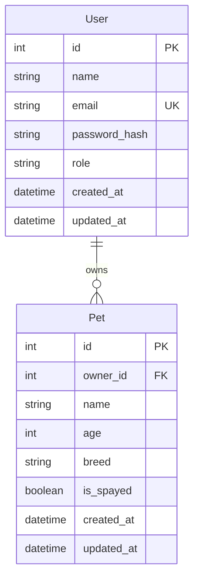
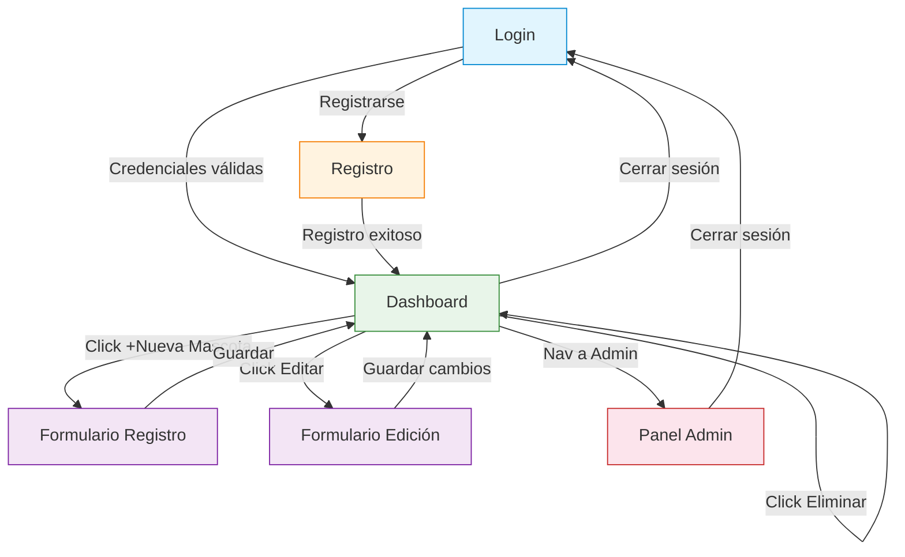
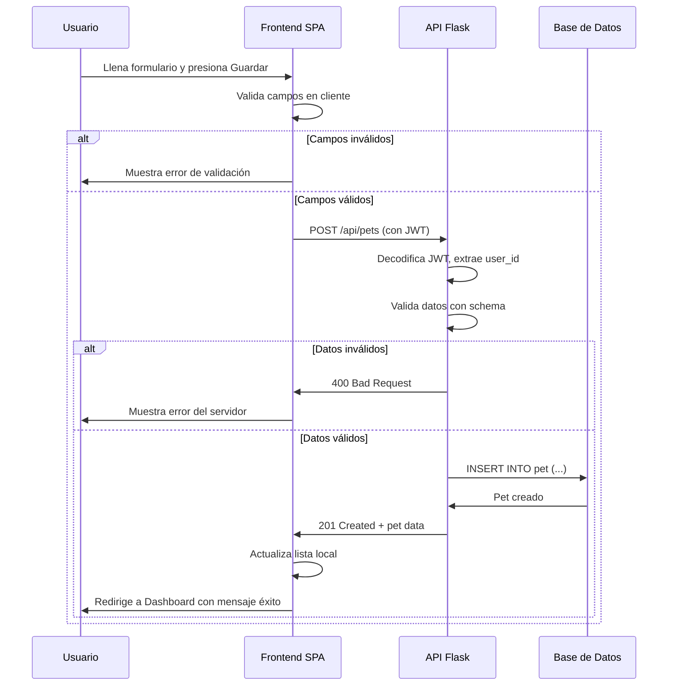
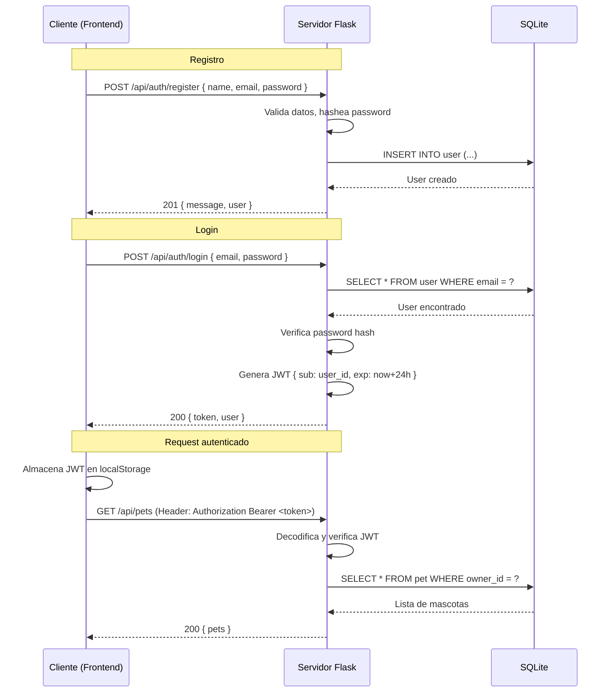

# Arquitectura del Proyecto "New Life"

> Plataforma web para registro de mascotas y seguimiento de esterilización canina.
> MVP - Versión 1.0

---

## Índice

1. [Resumen Ejecutivo](#1-resumen-ejecutivo)
2. [Estructura de Carpetas](#2-estructura-de-carpetas)
3. [Esquema de Base de Datos](#3-esquema-de-base-de-datos)
4. [Diseño de API REST](#4-diseño-de-api-rest)
5. [Diseño de Frontend](#5-diseño-de-frontend-pantallas-y-flujo)
6. [Diagrama de Flujo entre Pantallas](#6-diagrama-de-flujo-entre-pantallas)
7. [Decisiones Técnicas Clave](#7-decisiones-técnicas-clave)
8. [Plan de Implementación (para el modo Code)](#8-plan-de-implementación)

---

## 1. Resumen Ejecutivo

New Life es un prototipo funcional (MVP) que permite a usuarios registrarse, iniciar sesión, gestionar el registro de sus mascotas y verificar si cumplen con el estado de esterilización. El sistema distingue dos roles: **usuario regular** (dueño de mascotas) y **administrador** (panel de supervisión).

**Stack técnico:**
| Capa       | Tecnología       |
|------------|------------------|
| Backend    | Python + Flask   |
| Base de datos | SQLite        |
| ORM        | SQLAlchemy + Flask-SQLAlchemy |
| Autenticación | JWT (PyJWT)  |
| Frontend   | HTML + CSS + JavaScript vanilla |
| Estilo     | CSS Grid/Flexbox (responsive básico) |

---

## 2. Estructura de Carpetas

```
new-life/
│
├── backend/
│   ├── app.py                      # Punto de entrada de la aplicación Flask
│   ├── config.py                   # Configuración (SECRET_KEY, DB URI, etc.)
│   ├── extensions.py               # Inicialización de extensiones (db, jwt, bcrypt)
│   │
│   ├── models/
│   │   ├── __init__.py             # Re-exporta todos los modelos
│   │   ├── user.py                 # Modelo User
│   │   └── pet.py                  # Modelo Pet
│   │
│   ├── schemas/
│   │   ├── __init__.py
│   │   ├── user_schema.py          # Esquemas de validación para usuario
│   │   └── pet_schema.py           # Esquemas de validación para mascota
│   │
│   ├── crud/
│   │   ├── __init__.py
│   │   ├── user_crud.py            # Operaciones DB para usuarios
│   │   └── pet_crud.py             # Operaciones DB para mascotas
│   │
│   ├── routes/
│   │   ├── __init__.py
│   │   ├── auth_routes.py          # Endpoints de autenticación (registro, login)
│   │   ├── pet_routes.py           # Endpoints CRUD de mascotas
│   │   └── admin_routes.py         # Endpoints de panel admin (opcional)
│   │
│   ├── services/
│   │   ├── __init__.py
│   │   ├── auth_service.py         # Lógica de negocio: auth, generación JWT
│   │   └── pet_service.py          # Lógica de negocio: esterilización, reglas
│   │
│   └── utils/
│       ├── __init__.py
│       ├── decorators.py           # Decoradores (login_required, admin_required)
│       └── helpers.py              # Funciones auxiliares
│
├── frontend/
│   ├── index.html                  # SPA principal (punto de carga)
│   ├── css/
│   │   ├── style.css               # Estilos globales
│   │   └── components.css          # Estilos de componentes reutilizables
│   │
│   ├── js/
│   │   ├── app.js                  # Inicialización, router SPA
│   │   ├── api.js                  # Cliente HTTP (fetch wrapper con JWT)
│   │   ├── state.js                # Estado global de la aplicación
│   │   ├── components/
│   │   │   ├── auth.js             # Login/Registro forms y lógica
│   │   │   ├── dashboard.js        # Dashboard del usuario
│   │   │   ├── petForm.js          # Formulario de registro/edición de mascota
│   │   │   └── admin.js            # Panel de administración (opcional)
│   │   └── utils.js                # Utilidades (formateo, validación)
│   │
│   └── assets/
│       ├── logo.svg                # Logo de New Life
│       └── icons/                  # Iconos SVG
│
├── docs/
│   └── architecture.md             # Este documento
│
├── plans/
│   └── todo.md                     # Plan de implementación detallado
│
├── requirements.txt                # Dependencias del backend
├── .env.example                    # Variables de entorno de ejemplo
├── .gitignore
└── README.md
```

**Principio aplicado:** Separación por capas (Modelos → CRUD → Servicios → Rutas) para evitar que [`app.py`](backend/app.py) se convierta en un monolito inmantenible. Cada capa tiene una responsabilidad única (SRP - Single Responsibility Principle).

---

## 3. Esquema de Base de Datos

### 3.1 Diagrama Entidad-Relación



### 3.2 Tabla: `User`

| Columna         | Tipo         | Restricciones                          | Descripción                         |
|-----------------|--------------|----------------------------------------|-------------------------------------|
| `id`            | INTEGER      | PRIMARY KEY, AUTOINCREMENT             | Identificador único del usuario     |
| `name`          | VARCHAR(100) | NOT NULL                               | Nombre completo del usuario         |
| `email`         | VARCHAR(120) | NOT NULL, UNIQUE, INDEX                | Correo electrónico (login)          |
| `password_hash` | VARCHAR(256) | NOT NULL                               | Hash de contraseña (werkzeug)       |
| `role`          | VARCHAR(20)  | NOT NULL, DEFAULT 'user'               | Rol: `user` o `admin`               |
| `created_at`    | DATETIME     | NOT NULL, DEFAULT CURRENT_TIMESTAMP    | Fecha de registro                   |
| `updated_at`    | DATETIME     | NOT NULL, DEFAULT CURRENT_TIMESTAMP    | Última actualización                |

### 3.3 Tabla: `Pet`

| Columna      | Tipo         | Restricciones                          | Descripción                         |
|--------------|--------------|----------------------------------------|-------------------------------------|
| `id`         | INTEGER      | PRIMARY KEY, AUTOINCREMENT             | Identificador único de la mascota   |
| `owner_id`   | INTEGER      | NOT NULL, FOREIGN KEY → User.id, INDEX | Dueño de la mascota                 |
| `name`       | VARCHAR(100) | NOT NULL                               | Nombre de la mascota                |
| `age`        | INTEGER      | NOT NULL, CHECK(age >= 0)              | Edad en años                        |
| `breed`      | VARCHAR(100) | NOT NULL                               | Raza                                |
| `is_spayed`  | BOOLEAN      | NOT NULL, DEFAULT 0                    | Estado de esterilización             |
| `created_at` | DATETIME     | NOT NULL, DEFAULT CURRENT_TIMESTAMP    | Fecha de registro                   |
| `updated_at` | DATETIME     | NOT NULL, DEFAULT CURRENT_TIMESTAMP    | Última actualización                |

### 3.4 Índices recomendados

- `User.email` → búsqueda por email en login (único)
- `Pet.owner_id` → consulta de mascotas por usuario (FK index)

### 3.5 Modelo SQLAlchemy (`backend/models/`)

El modelo [`user.py`](backend/models/user.py) debe incluir:
- `password_hash` con método `set_password(password)` que use `generate_password_hash` de `werkzeug.security`
- Método `check_password(password)` que use `check_password_hash`

El modelo [`pet.py`](backend/models/pet.py) debe incluir:
- Relación `owner = db.relationship('User', backref='pets')`
- Propiedad `compliance_status` que retorne `"Cumple"` si `is_spayed == True`, `"No cumple"` en caso contrario

---

## 4. Diseño de API REST

### 4.1 Convenciones generales

- **Base URL:** `http://localhost:5000/api`
- **Formato:** JSON (`Content-Type: application/json`)
- **Autenticación:** JWT en header `Authorization: Bearer <token>`
- **Errores:** Respuesta uniforme `{ "error": "mensaje", "code": 400 }`

### 4.2 Endpoints de Autenticación

#### `POST /api/auth/register`
Registro de nuevo usuario.

| Campo     | Tipo   | Obligatorio | Validación                          |
|-----------|--------|-------------|-------------------------------------|
| `name`    | string | sí          | 2-100 caracteres                    |
| `email`   | string | sí          | Formato email válido, único en DB   |
| `password`| string | sí          | Mínimo 6 caracteres                 |

**Request:**
```json
{
  "name": "Juan Pérez",
  "email": "juan@example.com",
  "password": "secreto123"
}
```

**Response (201 Created):**
```json
{
  "message": "Usuario registrado exitosamente",
  "user": {
    "id": 1,
    "name": "Juan Pérez",
    "email": "juan@example.com",
    "role": "user"
  }
}
```

**Errors:** `400` si email ya existe o datos inválidos.

---

#### `POST /api/auth/login`
Inicio de sesión.

| Campo     | Tipo   | Obligatorio |
|-----------|--------|-------------|
| `email`   | string | sí          |
| `password`| string | sí          |

**Request:**
```json
{
  "email": "juan@example.com",
  "password": "secreto123"
}
```

**Response (200 OK):**
```json
{
  "token": "eyJhbGciOiJIUzI1NiIs...",
  "user": {
    "id": 1,
    "name": "Juan Pérez",
    "email": "juan@example.com",
    "role": "user"
  }
}
```

**Errors:** `401` si credenciales inválidas.

---

#### `GET /api/auth/me`
Obtener datos del usuario autenticado. **(Requiere JWT)**

**Response (200 OK):**
```json
{
  "id": 1,
  "name": "Juan Pérez",
  "email": "juan@example.com",
  "role": "user",
  "created_at": "2026-05-02T10:00:00"
}
```

**Errors:** `401` si token inválido o expirado.

---

### 4.3 Endpoints de Mascotas (requieren JWT)

#### `GET /api/pets`
Listar todas las mascotas del usuario autenticado.

**Response (200 OK):**
```json
{
  "pets": [
    {
      "id": 1,
      "name": "Firulais",
      "age": 3,
      "breed": "Labrador",
      "is_spayed": true,
      "compliance_status": "Cumple",
      "created_at": "2026-05-01T10:00:00"
    },
    {
      "id": 2,
      "name": "Luna",
      "age": 1,
      "breed": "Poodle",
      "is_spayed": false,
      "compliance_status": "No cumple",
      "created_at": "2026-05-01T11:00:00"
    }
  ],
  "total": 2
}
```

---

#### `POST /api/pets`
Registrar una nueva mascota.

| Campo       | Tipo    | Obligatorio | Validación                     |
|-------------|---------|-------------|--------------------------------|
| `name`      | string  | sí          | 1-100 caracteres               |
| `age`       | integer | sí          | >= 0                           |
| `breed`     | string  | sí          | 1-100 caracteres               |
| `is_spayed` | boolean | sí          | true o false                   |

**Request:**
```json
{
  "name": "Firulais",
  "age": 3,
  "breed": "Labrador",
  "is_spayed": false
}
```

**Response (201 Created):**
```json
{
  "message": "Mascota registrada exitosamente",
  "pet": {
    "id": 1,
    "name": "Firulais",
    "age": 3,
    "breed": "Labrador",
    "is_spayed": false,
    "compliance_status": "No cumple"
  }
}
```

---

#### `GET /api/pets/<int:pet_id>`
Obtener detalles de una mascota específica.

**Response (200 OK):**
```json
{
  "id": 1,
  "name": "Firulais",
  "age": 3,
  "breed": "Labrador",
  "is_spayed": false,
  "compliance_status": "No cumple",
  "created_at": "2026-05-01T10:00:00"
}
```

**Errors:** `404` si la mascota no existe o no pertenece al usuario.

---

#### `PUT /api/pets/<int:pet_id>`
Actualizar datos de una mascota.

| Campo       | Tipo    | Obligatorio |
|-------------|---------|-------------|
| `name`      | string  | no          |
| `age`       | integer | no          |
| `breed`     | string  | no          |
| `is_spayed` | boolean | no          |

**Request (actualizar solo esterilización):**
```json
{
  "is_spayed": true
}
```

**Response (200 OK):**
```json
{
  "message": "Mascota actualizada exitosamente",
  "pet": {
    "id": 1,
    "name": "Firulais",
    "age": 3,
    "breed": "Labrador",
    "is_spayed": true,
    "compliance_status": "Cumple"
  }
}
```

**Errors:** `403` si la mascota no pertenece al usuario autenticado.

---

#### `DELETE /api/pets/<int:pet_id>`
Eliminar una mascota.

**Response (200 OK):**
```json
{
  "message": "Mascota eliminada exitosamente"
}
```

**Errors:** `403` si no pertenece al usuario, `404` si no existe.

---

### 4.4 Endpoints de Administración (requieren JWT + role=admin)

#### `GET /api/admin/users`
Listar todos los usuarios (solo admin).

**Response (200 OK):**
```json
{
  "users": [
    {
      "id": 1,
      "name": "Juan Pérez",
      "email": "juan@example.com",
      "role": "user",
      "pet_count": 2,
      "created_at": "2026-05-01T10:00:00"
    }
  ],
  "total": 1
}
```

---

#### `GET /api/admin/pets`
Listar todas las mascotas del sistema (solo admin).

**Response (200 OK):**
```json
{
  "pets": [
    {
      "id": 1,
      "name": "Firulais",
      "age": 3,
      "breed": "Labrador",
      "is_spayed": true,
      "compliance_status": "Cumple",
      "owner_name": "Juan Pérez"
    }
  ],
  "total": 1,
  "compliance_rate": 0.5
}
```

---

### 4.5 Resumen de Endpoints

| Método | Ruta                          | Auth     | Rol    | Descripción                  |
|--------|-------------------------------|----------|--------|------------------------------|
| POST   | `/api/auth/register`          | No       | -      | Registrar usuario            |
| POST   | `/api/auth/login`             | No       | -      | Iniciar sesión               |
| GET    | `/api/auth/me`                | JWT      | user   | Perfil del usuario           |
| GET    | `/api/pets`                   | JWT      | user   | Listar mascotas propias      |
| POST   | `/api/pets`                   | JWT      | user   | Crear mascota                |
| GET    | `/api/pets/<id>`              | JWT      | user   | Detalle de mascota           |
| PUT    | `/api/pets/<id>`              | JWT      | user   | Actualizar mascota           |
| DELETE | `/api/pets/<id>`              | JWT      | user   | Eliminar mascota             |
| GET    | `/api/admin/users`            | JWT      | admin  | Listar usuarios (admin)      |
| GET    | `/api/admin/pets`             | JWT      | admin  | Listar mascotas (admin)      |

---

## 5. Diseño de Frontend (Pantallas y Flujo)

### 5.1 Principios de UI/UX

- **Single Page Application (SPA):** Toda la navegación ocurre en [`frontend/index.html`](frontend/index.html) sin recargas de página.
- **Routing del lado del cliente:** El archivo [`app.js`](frontend/js/app.js) gestiona la navegación entre "vistas" (divs que se muestran/ocultan).
- **Responsive:** CSS Grid/Flexbox para adaptarse a móvil y escritorio.
- **Estados:** Cada vista maneja 3 estados: `loading`, `error`, `success`.

### 5.2 Pantallas

#### Pantalla 1: Login / Registro

**Archivos:** [`auth.js`](frontend/js/components/auth.js), [`components.css`](frontend/css/components.css)

**Elementos:**
- Formulario de Login: email + contraseña + botón "Iniciar Sesión"
- Enlace/tab "¿No tienes cuenta? Regístrate" → cambia a formulario de registro
- Formulario de Registro: nombre + email + contraseña + confirmar contraseña + botón "Crear Cuenta"
- Validación en cliente antes de enviar
- Mensajes de error visibles (credenciales inválidas, email duplicado)

**Flujo:**
1. Usuario ingresa credenciales → `POST /api/auth/login`
2. Si éxito → almacena JWT en `localStorage` → redirige al Dashboard
3. Si error → muestra mensaje en pantalla

---

#### Pantalla 2: Dashboard del Usuario

**Archivos:** [`dashboard.js`](frontend/js/components/dashboard.js)

**Elementos:**
- Header con nombre del usuario y botón "Cerrar Sesión"
- Botón "+ Nueva Mascota" → navega al formulario de registro
- Tarjetas de mascotas (grid de cards):
  - Nombre, Raza, Edad
  - Indicador de esterilización con color: 🟢 "Cumple" / 🔴 "No cumple"
  - Botón "Editar" → navega al formulario de edición
  - Botón "Eliminar" con confirmación
- Estado vacío: mensaje "Aún no has registrado mascotas" + botón para registrar

**Flujo:**
1. Al cargar → `GET /api/pets` (con JWT) → renderiza cards
2. Al hacer clic en "Editar" → `GET /api/pets/<id>` → carga datos en formulario
3. Al hacer clic en "Eliminar" → confirmación → `DELETE /api/pets/<id>` → refresca lista

---

#### Pantalla 3: Formulario de Mascota (Registro/Edición)

**Archivos:** [`petForm.js`](frontend/js/components/petForm.js)

**Modos:**
- **Registro:** campos vacíos, título "Registrar Nueva Mascota"
- **Edición:** campos precargados, título "Editar Mascota"

**Campos:**
| Campo       | Tipo        | Validación                     |
|-------------|-------------|--------------------------------|
| Nombre      | text input  | Requerido, máx 100 chars       |
| Edad        | number input| Requerido, >= 0                |
| Raza        | text input  | Requerido, máx 100 chars       |
| Esterilizado| checkbox    | Booleano (marcado = esterilizado) |

**Botones:**
- "Guardar" → `POST /api/pets` (registro) o `PUT /api/pets/<id>` (edición)
- "Cancelar" → vuelve al Dashboard

---

#### Pantalla 4: Panel de Administración (Opcional)

**Archivos:** [`admin.js`](frontend/js/components/admin.js)

**Elementos:**
- Tabla de usuarios: ID, nombre, email, fecha de registro, cantidad de mascotas
- Tabla de mascotas: ID, nombre, dueño, raza, estado de esterilización
- Estadísticas: total mascotas, tasa de cumplimiento (esterilizados / total)
- Solo accesible si `user.role === "admin"`

---

### 5.3 Mapa de Navegación (Frontend)

```
/ (index.html)
├── #login          → Pantalla de inicio de sesión
├── #register       → Pantalla de registro
├── #dashboard      → Dashboard del usuario (protegida)
├── #pet/new        → Formulario nueva mascota (protegida)
├── #pet/<id>/edit  → Formulario editar mascota (protegida)
└── #admin          → Panel de admin (protegida, role=admin)
```

El router SPA en [`app.js`](frontend/js/app.js) interpreta el hash de la URL y renderiza la vista correspondiente. Las rutas protegidas redirigen a `#login` si no hay JWT.

---

## 6. Diagrama de Flujo entre Pantallas



### Flujo de datos en el registro/actualización de mascota



---

## 7. Decisiones Técnicas Clave

### 7.1 ¿Por qué Flask y no Django?

| Criterio          | Flask                          | Django                         |
|-------------------|--------------------------------|--------------------------------|
| Curva de aprendizaje | Baja                         | Alta                           |
| Tamaño del proyecto | MVP pequeño                  | Proyecto grande                |
| Flexibilidad      | Alta (elige componentes)       | Media (baterías incluidas)     |
| Tiempo de setup   | Minutos                        | Días (configuración inicial)   |

**Decisión:** Flask. Para un MVP de ~10 endpoints, Django es sobredimensionado. Flask permite iterar rápido y mantener el código ligero. Si el proyecto escala, se puede migrar a Django o FastAPI posteriormente.

### 7.2 ¿Por qué SQLite y no PostgreSQL/MySQL?

| Criterio          | SQLite                         | PostgreSQL                     |
|-------------------|--------------------------------|--------------------------------|
| Setup             | Zero config (archivo)          | Requiere servidor              |
| Escalabilidad     | Baja (1 escritor)              | Alta (concurrente)             |
| Portabilidad      | Un solo archivo `.db`          | Requiere dump/restore          |
| Ideal para        | Prototipos, dev local          | Producción con varios usuarios |

**Decisión:** SQLite. Para un MVP donde el usuario único o unas pocas pruebas concurrentes son el escenario, SQLite es suficiente. La migración a PostgreSQL en producción se hace cambiando la URI en [`config.py`](backend/config.py).

### 7.3 ¿Por qué JWT y no Sesiones?

| Criterio          | JWT                             | Sesiones (cookie+session)      |
|-------------------|---------------------------------|--------------------------------|
| Statefulness      | Stateless (no DB lookup)        | Stateful (requiere almacén)    |
| Frontend          | Ideal para SPA (header directo) | Requiere cookies, CSRF         |
| Escalabilidad     | Alta (cualquier servidor sirve) | Media (sesiones en servidor)   |
| Complejidad       | Media                           | Baja                           |

**Decisión:** JWT. Dado que el frontend es una SPA en vanilla JS, JWT se envía directamente en el header `Authorization`. No requiere manejo de cookies ni protección CSRF. El token se almacena en `localStorage`.

### 7.4 ¿Por qué Separación en Capas (Models, CRUD, Services, Routes)?

```
Rutas (routes/) → reciben requests HTTP, delegan a servicios
    ↓
Servicios (services/) → contienen lógica de negocio, orquestan CRUD
    ↓
CRUD (crud/) → operaciones atómicas de base de datos
    ↓
Modelos (models/) → definición de tablas y relaciones SQLAlchemy
```

**Beneficios:**
1. **Testabilidad:** Cada capa se prueba de forma independiente.
2. **Mantenibilidad:** Si cambia la lógica de negocio, solo se modifica `services/`.
3. **Reutilización:** El CRUD puede ser usado por diferentes servicios.
4. **Escalabilidad:** Agregar un endpoint nuevo implica crear ruta → servicio → crud sin tocar código existente.

### 7.5 ¿Por qué Vanilla JS y no React/Vue?

| Criterio          | Vanilla JS                     | React/Vue                      |
|-------------------|---------------------------------|--------------------------------|
| Bundle size       | ~0 KB (navegador)               | ~40-100 KB minimizado          |
| Curva de aprendizaje | Nula (JS puro)               | Media-Alta                     |
| Tooling           | Ninguno (solo editor)           | Webpack, Babel, CLI            |
| Ideal para        | MVPs, prototipos rápidos        | Apps complejas y grandes       |

**Decisión:** Vanilla JS. Para 4-5 pantallas con lógica simple, un framework SPA es sobredimensionado. El código se organiza en módulos (cada archivo es un "componente" funcional) sin necesidad de transpilación.

### 7.6 Seguridad Mínima (Prototipo)

| Medida                    | Implementación                                              |
|---------------------------|-------------------------------------------------------------|
| Hash de contraseñas       | `werkzeug.security.generate_password_hash` (pbkdf2:sha256) |
| JWT signing               | `PyJWT` con algoritmo HS256 y expiración de 24h             |
| Protección de rutas       | Decorador `@jwt_required` que verifica token en cada request |
| Validación de datos       | Esquemas manuales o `marshmallow` (opcional, liviano)      |
| CORS                      | `flask-cors` habilitado para desarrollo local              |
| SQL Injection             | SQLAlchemy (ORM) previene inyecciones por diseño            |
| XSS                       | Escape de datos en frontend (textContent, no innerHTML)     |

---

## 8. Plan de Implementación

### Capa de Datos (Backend Foundation)

- [ ] [**P1**] Crear [`backend/config.py`](backend/config.py) con configuración de Flask, SQLAlchemy URI, JWT secret key
- [ ] [**P1**] Crear [`backend/extensions.py`](backend/extensions.py) inicializando `db = SQLAlchemy()`
- [ ] [**P1**] Crear [`backend/models/user.py`](backend/models/user.py) con modelo `User` (id, name, email, password_hash, role, timestamps)
- [ ] [**P1**] Crear [`backend/models/pet.py`](backend/models/pet.py) con modelo `Pet` (id, owner_id FK, name, age, breed, is_spayed, timestamps, compliance_status)
- [ ] [**P1**] Crear [`backend/models/__init__.py`](backend/models/__init__.py) que re-exporte ambos modelos

### Capa de Acceso a Datos (CRUD)

- [ ] [**P1**] Crear [`backend/crud/user_crud.py`](backend/crud/user_crud.py) con funciones: `get_user_by_id`, `get_user_by_email`, `create_user`
- [ ] [**P1**] Crear [`backend/crud/pet_crud.py`](backend/crud/pet_crud.py) con funciones: `get_pets_by_owner`, `get_pet_by_id`, `create_pet`, `update_pet`, `delete_pet`
- [ ] [**P2**] Crear [`backend/crud/pet_crud.py`](backend/crud/pet_crud.py) función `get_all_pets_with_owners` (para admin)
- [ ] [**P2**] Crear [`backend/crud/user_crud.py`](backend/crud/user_crud.py) función `get_all_users_with_pet_count` (para admin)

### Capa de Lógica de Negocio (Services)

- [ ] [**P1**] Crear [`backend/services/auth_service.py`](backend/services/auth_service.py) con: `register_user`, `authenticate_user`, `generate_token`, `verify_token`
- [ ] [**P1**] Crear [`backend/services/pet_service.py`](backend/services/pet_service.py) con: `create_pet_for_user`, `update_pet_for_user`, `delete_pet_for_user`, `get_user_pets`, `get_compliance_status`
- [ ] [**P2**] Crear [`backend/services/pet_service.py`](backend/services/pet_service.py) función `get_all_pets_admin` (para admin)

### Capa de API (Routes)

- [ ] [**P1**] Crear [`backend/utils/decorators.py`](backend/utils/decorators.py) con decoradores `@jwt_required` y `@admin_required`
- [ ] [**P1**] Crear [`backend/routes/auth_routes.py`](backend/routes/auth_routes.py) con blueprint `/api/auth` y endpoints register, login, me
- [ ] [**P1**] Crear [`backend/routes/pet_routes.py`](backend/routes/pet_routes.py) con blueprint `/api/pets` y CRUD completo
- [ ] [**P2**] Crear [`backend/routes/admin_routes.py`](backend/routes/admin_routes.py) con blueprint `/api/admin` y endpoints users, pets
- [ ] [**P1**] Crear [`backend/app.py`](backend/app.py) punto de entrada: crear app Flask, registrar blueprints, crear tablas

### Frontend

- [ ] [**P1**] Crear [`frontend/index.html`](frontend/index.html) estructura HTML con contenedores para cada vista
- [ ] [**P1**] Crear [`frontend/css/style.css`](frontend/css/style.css) estilos globales (reset, variables CSS, layout)
- [ ] [**P1**] Crear [`frontend/css/components.css`](frontend/css/components.css) estilos de componentes (cards, formularios, header)
- [ ] [**P1**] Crear [`frontend/js/api.js`](frontend/js/api.js) cliente HTTP: función `apiRequest(method, url, body)` que incluye JWT automáticamente
- [ ] [**P1**] Crear [`frontend/js/state.js`](frontend/js/state.js) estado global: `getToken()`, `setToken()`, `getUser()`, `setUser()`, `logout()`
- [ ] [**P1**] Crear [`frontend/js/app.js`](frontend/js/app.js) router SPA: escucha hashchange, renderiza vista, verifica autenticación
- [ ] [**P1**] Crear [`frontend/js/components/auth.js`](frontend/js/components/auth.js) lógica de login/registro con validación
- [ ] [**P1**] Crear [`frontend/js/components/dashboard.js`](frontend/js/components/dashboard.js) renderizado de lista de mascotas, botones editar/eliminar
- [ ] [**P1**] Crear [`frontend/js/components/petForm.js`](frontend/js/components/petForm.js) formulario reutilizable registro/edición
- [ ] [**P2**] Crear [`frontend/js/components/admin.js`](frontend/js/components/admin.js) panel de administración con tablas
- [ ] [**P1**] Crear [`frontend/js/utils.js`](frontend/js/utils.js) utilidades: `showLoading()`, `showError()`, `formatDate()`, validaciones cliente

### Infraestructura

- [ ] [**P1**] Crear [`requirements.txt`](requirements.txt) con dependencias: flask, flask-sqlalchemy, pyjwt, werkzeug, flask-cors
- [ ] [**P1**] Crear [`.env.example`](.env.example) con variables: `SECRET_KEY`, `DATABASE_URL`, `JWT_EXPIRATION_HOURS`
- [ ] [**P1**] Crear [`.gitignore`](.gitignore) excluyendo `*.db`, `__pycache__`, `.env`, `venv/`
- [ ] [**P1**] Crear [`README.md`](README.md) con instrucciones de instalación y ejecución

---

## Apéndice A: Flujo de Autenticación (JWT)



---

## Apéndice B: Variables de Entorno

```env
# .env.example
SECRET_KEY=change-this-to-a-random-secret-key
DATABASE_URL=sqlite:///newlife.db
JWT_EXPIRATION_HOURS=24
FLASK_ENV=development
FLASK_APP=backend/app.py
```

---

## Apéndice C: Dependencias (requirements.txt)

```
Flask==3.1.*
Flask-SQLAlchemy==3.1.*
Flask-CORS==5.*
PyJWT==2.*
Werkzeug==3.*
python-dotenv==1.*
```

---

> **Documento de Arquitectura v1.0**
> Fecha: 2026-05-02
> Autor: Roo (Arquitecto)
> Estado: Pendiente de aprobación para implementación
